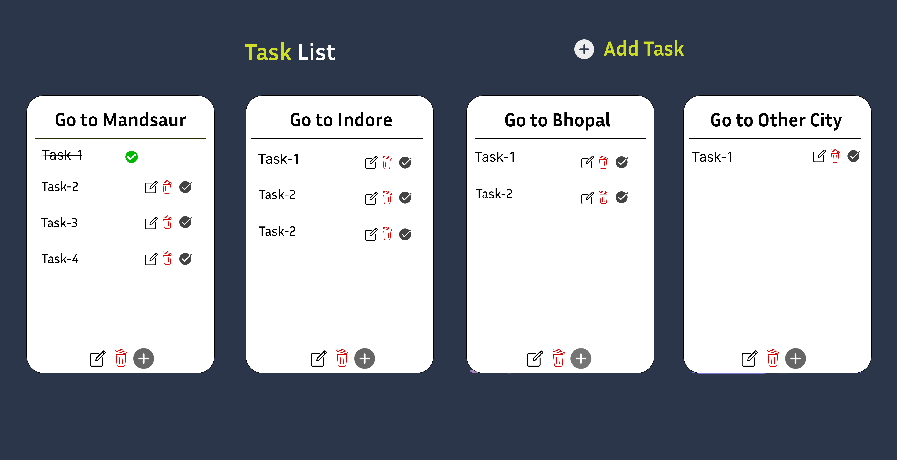

  

## Project Overview

Hello there!

I'm excited to present to you my Todo App project. This web application is designed to help users manage their tasks and stay organized. It allows users to create, update, and delete tasks, as well as mark them as completed. The app is built using JavaScript, HTML, and CSS, and it leverages the power of the browser's local storage to store the task data.

## Features

1. **Task Creation**: Users can easily create new tasks by entering a title and a description. Once created, the task is displayed in the task list.
2. **Task Update**: Users can edit existing tasks to modify the title, description, or other details.
3. **Task Deletion**: Users can delete tasks that are no longer needed. This action removes the task from the task list.
4. **Task Completion**: Users can mark tasks as completed, providing a visual indication of their progress.
5. **Persistent Data**: The app utilizes the browser's local storage to store the task data. This means that even if the user refreshes the page or closes the browser, their tasks will be saved and available upon returning to the app.

## Code Explanation

The project's codebase is organized into different files and folders to maintain a clear structure. Here's a breakdown of the main components and their functionalities:

1. **index.html**: This file represents the user interface of the Todo app. It defines the structure of the webpage, including the task input form, task list, and buttons for various actions.
2. **style.css**: This file contains the CSS styles that define the appearance and layout of the app. It provides a visually appealing and user-friendly interface.
3. **script.js**: This is the JavaScript file that handles the logic and functionality of the Todo app. It includes event listeners, functions for creating, updating, and deleting tasks, as well as handling local storage operations.

The code follows best practices in terms of readability, modularity, and separation of concerns. It utilizes modern JavaScript features, such as ES6 syntax, and leverages the power of DOM manipulation to dynamically update the user interface based on user actions.

## Conclusion

In conclusion, this Todo app project demonstrates my proficiency in JavaScript, HTML, and CSS, as well as my ability to develop a functional and user-friendly web application. The app provides an intuitive and efficient way for users to manage their tasks, and the code is structured and organized for easy maintenance and scalability.

I hope you find this project valuable and appreciate your time in reviewing it. Please feel free to provide any feedback or suggestions for improvement. Thank you!

---

I have created a To-Do App using JavaScript and hosted it on GitHub Pages. Let's take a closer look at your code and project.

- GitHub Repository: https://github.com/SevenSquare-Tech/todo-list-app
